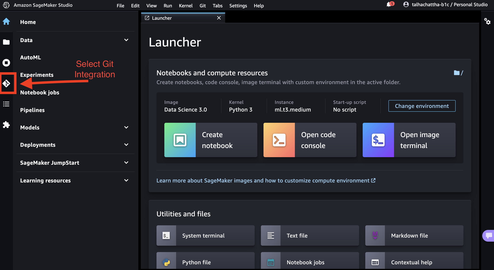

# Amazon Bedrock - Immersion Day
This repository walks through Amazon Bedrock and it's patterns. You will be able to learn how to generate text, summarize text, build a chatbot and also how to integrate documents with a chatbot, finally you will be able to combine all your learning in a front-end chatbot application.

## Prerequisites
For you to run this Immersion Day you would need the following
>#### AWS Account
An active AWS account will be needed to run this as we will be using primarily Amazon Bedrock service. If you are participating in an instructor-led event, this account will be provided to you by AWS experts on-site. Make sure you follow the instructions from them to access an account.

>### Enable AWS IAM permissions for Bedrock
An AWS identity (IAM Role) will be needed that grants you access to the underlying service(s), in this case Amazon Bedrock, such that you can effectively run the labs in this repository. This  AWS identity can then be assumed from your notebook environment (which is the [*Studio/notebook Execution Role*](https://docs.aws.amazon.com/sagemaker/latest/dg/sagemaker-roles.html) from SageMaker, or could be a role or IAM User for self-managed notebooks), must have sufficient [AWS IAM permissions](https://docs.aws.amazon.com/IAM/latest/UserGuide/access_policies.html) to call the Amazon Bedrock service.

To grant Bedrock access to your identity, you can:

- Open the [AWS IAM Console](https://us-east-1.console.aws.amazon.com/iam/home?#)
- Find your [Role](https://us-east-1.console.aws.amazon.com/iamv2/home?#/roles) (if using SageMaker or otherwise assuming an IAM Role), or else [User](https://us-east-1.console.aws.amazon.com/iamv2/home?#/users)
- Select *Add Permissions > Create Inline Policy* to attach new inline permissions, open the *JSON* editor and paste in the below example policy:

    ```
    {
        "Version": "2012-10-17",
        "Statement": [
            {
                "Sid": "BedrockFullAccess",
                "Effect": "Allow",
                "Action": ["bedrock:*"],
                "Resource": "*"
            }
        ]
    }
    ```
- In addition to Amazon Bedrock, you also need access to Amazon DynamoDB with the help of an AWS managed policy [`AmazonDynamoDBFullAccess`](https://docs.aws.amazon.com/aws-managed-policy/latest/reference/AmazonDynamoDBFullAccess.html). You can do this by selecting *Add Permissions > Attach policies*, then search for `AmazonDynamoDBFullAccess` and select the checkbox on the left, you can then finish by selecting `Add Permission`.

    > ⚠️ **Note:** With Amazon SageMaker, your notebook execution role will typically be *separate* from the user or role that you log in to the AWS Console with. If you'd like to explore the AWS Console for Amazon Bedrock, you'll need to grant permissions to your Console user/role too.

For more information on the fine-grained action and resource permissions in Bedrock, check out the Bedrock Developer Guide.


>### Choose a notebook environment
This workshop is presented as a series of **Python notebooks**, which you can run from the environment of your choice:

- For a fully-managed environment with rich AI/ML features, we'd recommend using [SageMaker Studio](https://aws.amazon.com/sagemaker/studio/). To get started quickly, you can refer to the [instructions for domain quick setup](https://docs.aws.amazon.com/sagemaker/latest/dg/onboard-quick-start.html).
- For a fully-managed but more basic experience, you could instead [create a SageMaker Notebook Instance](https://docs.aws.amazon.com/sagemaker/latest/dg/howitworks-create-ws.html).
- If you prefer to use your existing (local or other) notebook environment, make sure it has [credentials for calling AWS](https://docs.aws.amazon.com/cli/latest/userguide/cli-chap-configure.html).


## Key Tools & Services
- [Amazon Bedrock](https://aws.amazon.com/bedrock/)
- [Amazon DynamoDB](https://aws.amazon.com/dynamodb/)
- [LangChain](https://www.langchain.com/)
- [Streamlit](https://streamlit.io/)

## Labs
1. [Getting Started with Amazon Bedrock](./00-Bedrock_101.ipynb)
    
    In this notebook you will learn about how to use Amazon Bedrock, what different models are available, the parameters that go into each model and how you can use them to generate text or images.
2. [Text Generation with Amazon Bedrock + LangChain](./01-Text_Generation_%26_Summarization.ipynb)

    In this notebook you will learn about Bedrock integration with LangChain and how you can easily generate text for your use-cases, you will also learn how to provide context as well as how these models can summarize text for you.
3. [Build a chatbot using Amazon Bedrock](./02_Chat_with_Bedrock.ipynb)
    This notebook dives into the advanved topics of prompting and how you can use those to build a chatbot with the help of LangChain and Bedrock. You will see different ways of creating a conversational interface. Also you will be able to store your chats in a persistent table using Amazon DynamoDB.
4. [Bring in your documents to Amazon Bedrock](./03_Documents_powered_Chat.ipynb)
    Now you will be to understand the pattern of RAG (Retrieval Augmented Generation) which allows you to enhance the capabilities of a Large Langugage Model (LLM) by bringing in your own data. You will learn about embeddings, vector store and chains in this notebook.
5. [Chatbot Application](./app.py)
    Finally, you can understand how to build a sample chatbot application, with the help of Streamlit and connect all the topics we learned before. This application will leverage the vectorstore you created before and also you can visually interact with the chatbot while also seeing your previous interactions.

## Steps
1. Clone the repository



2. Run the notebook


3. Repeat the step above for all the notebooks in the directory
4. Create a system terminal from the Launcher


Here you can install and run the chatbot application with the following commands:
    ```
    cd ./Amazon-Bedrock-Immersion-Day/
    pip install -r requirements.txt --quiet
    streamlit run app.py
    ```
5. Visualize

For you to open the visual application you need to copy the URL from your browser window and complete it as follows:
    ```
    https://d-xxxxxxx.studio.us-east-1.sagemaker.aws/jupyter/default/proxy/8501/
    ```
    >Note: *Don't forget the last `/`, you will not be able to see the application without it.*